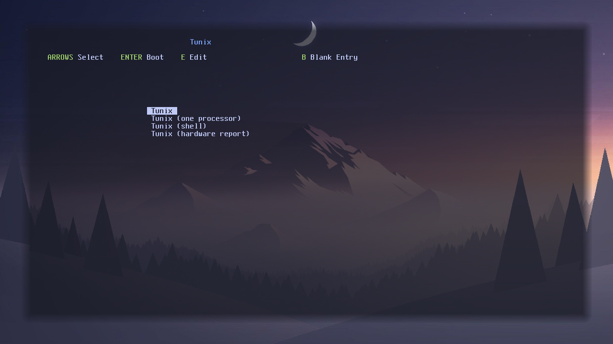
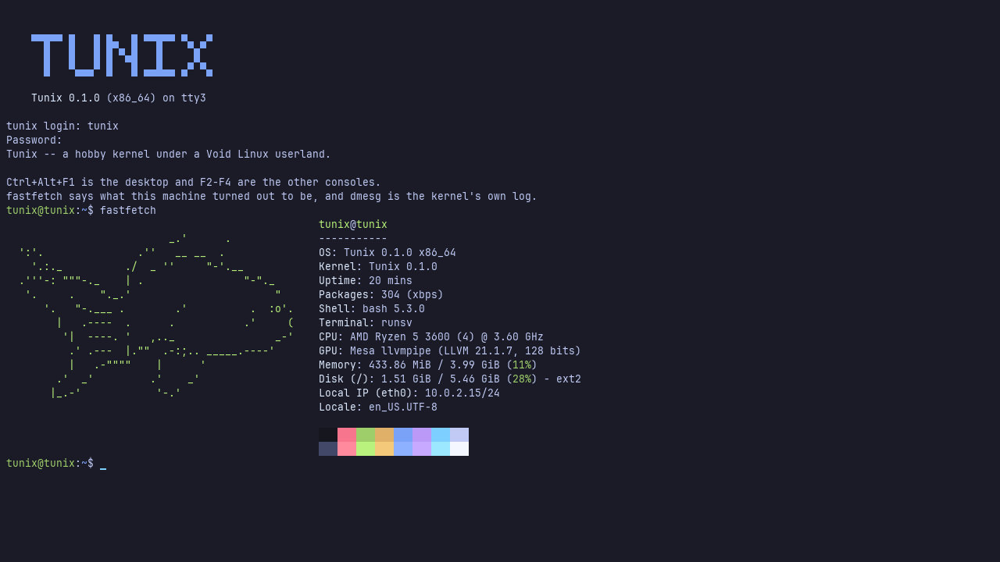

# Tunix

A Unix-like operating system for x86_64: a kernel written from scratch, booted
by Limine, running an unmodified Void Linux userland on top of it.


Nothing above the kernel is written here. The image is Void's own glibc
packages, installed by Void's own package manager, on Void's own init. When one
of them does not work, the kernel is wrong, which is a much better test than a
userland built to suit it.

## What it is

A monolithic kernel: virtual memory with copy-on-write fork, preemptive
scheduling across every processor the firmware describes, ELF and a dynamic
linker, signals, and a Linux-compatible syscall table.

On top of it, runit as PID 1 with udevd and agetty, Void's bash, coreutils,
sudo, curl and htop, and a Weston desktop that gets the display through seatd
and opens with Firefox on it.

Underneath: a block layer over IDE, AHCI, NVMe and USB storage, with GPT and MBR
partitions and a read-write ext3 root that `mkfs.ext3` made; IPv4 with both ends
of TCP over RTL8139; a framebuffer console with eight virtual terminals on
Ctrl+Alt+F1..F8; Intel HD Audio behind ALSA; xHCI keyboard and mouse; and real
users, permissions and setuid. The virtio-gpu driver scans the display out where
it lies, and `make run-virgl` renders on the host's own GPU through virgl.

## Quick start

```sh
make          # kernel, sysroot and image
make run      # boot it
```

The first build downloads a Void rootfs and about 600 MiB of packages. The
sysroot has to be built as root, on a filesystem that can hold ownership and the
setuid bit. See [Build and Run](docs/build-and-run.md) if yours cannot.

It boots into Weston with Firefox already open. Ctrl+Alt+F2 leaves it for a
text console, where you can
log in as `tunix` / `tunix` or `root` / `tunix`, and Ctrl+Alt+F1 goes back.

| The boot menu | A text console |
| --- | --- |
|  |  |

## Layout

```
kernel/       arch/ drivers/ fs/ net/ ipc/ tty/ lib/, and the core beside them
base-files/   what makes the Void sysroot into Tunix
support/      the sysroot and image builders, limine.conf, the font tool
docs/         how each part works, and the roadmap
GNUmakefile   the whole build
```

The build finds sources by walking `kernel/`, so a new file needs no entry
anywhere; only its includes have to know how far down it sits.
