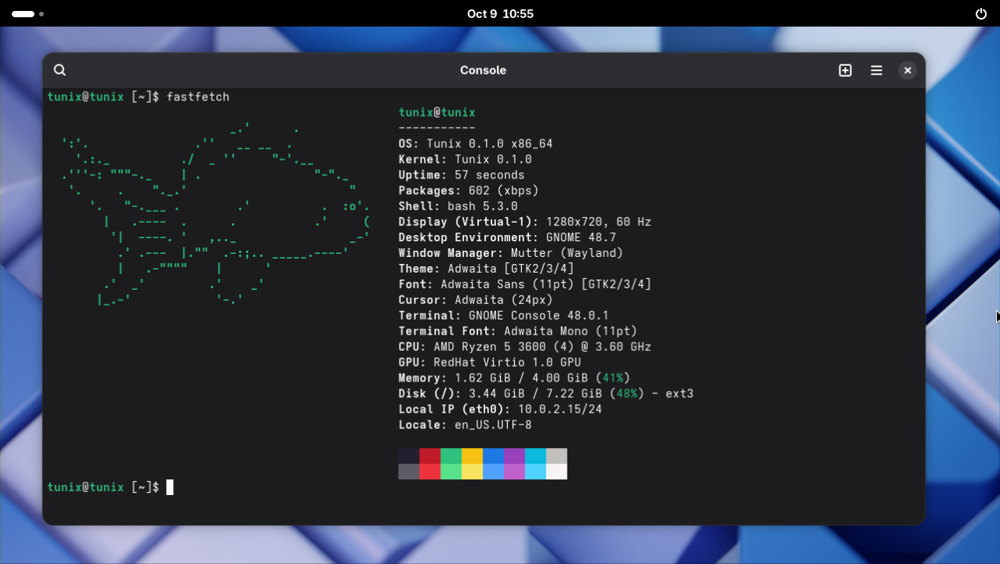

# Tunix

[](https://github.com/tuna4ll/tunix/actions/workflows/ci.yml)



A Unix-like kernel for x86_64 and aarch64 that runs an unmodified Void Linux userland.

## Build and run

```sh
make        # kernel and disk image
make run    # boot it in QEMU
make test   # run the kernel tests
```

Log in as `root` with the password `tunix`.

## Layout

```
kernel/       the kernel
base-files/   files added to the Void userland
tools/        image builder, boot config and tests
docs/         kernel documentation
```

## License

MIT
