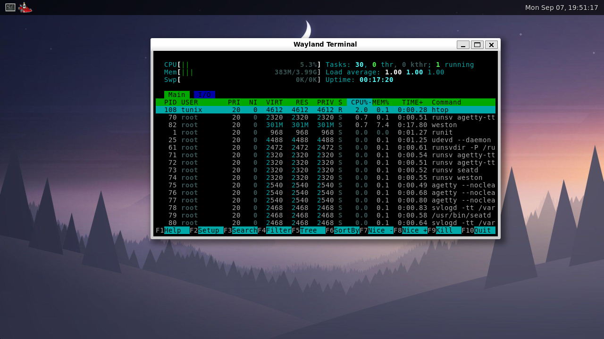
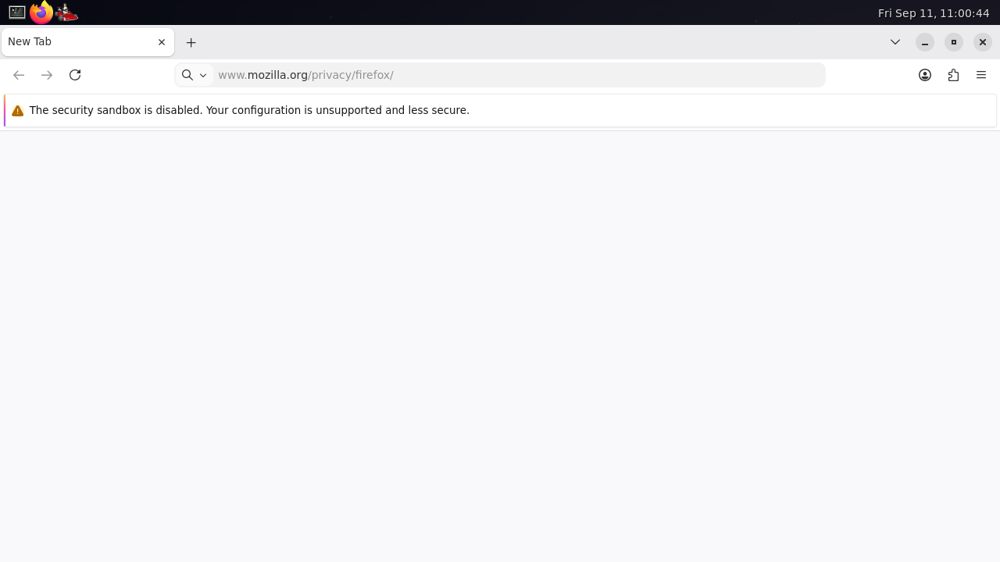
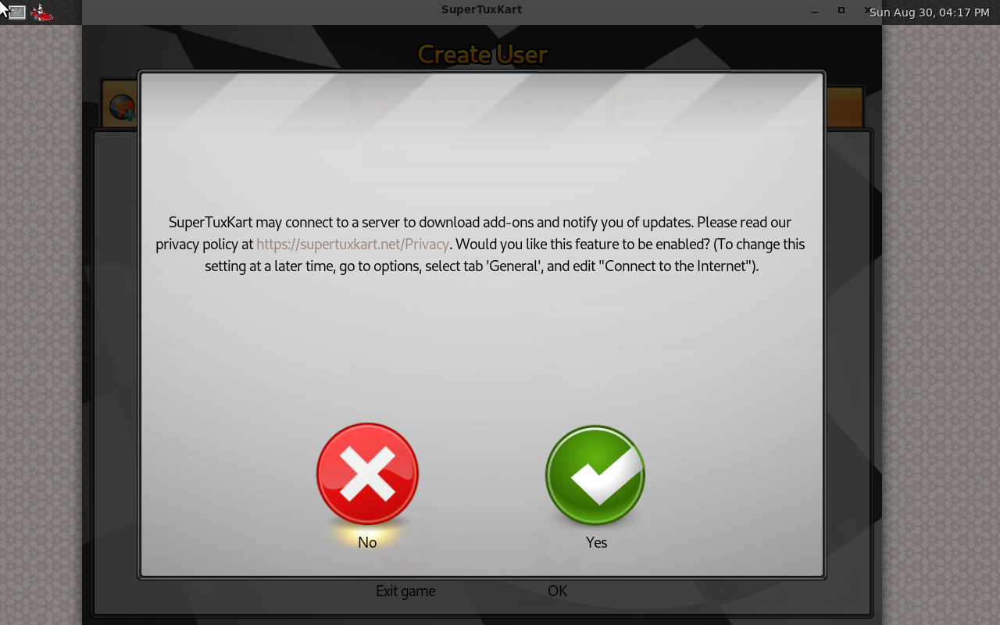

# The graphical session

Tunix boots into [Weston](https://gitlab.freedesktop.org/wayland/weston), the
reference Wayland compositor, running as the `tunix` user. It is Void's own
`weston` package: nothing in it was built here and nothing in it is patched.



```sh
make run-gpu     # a window, with the desktop in it
make run         # the same image, without one
```

Ctrl+Alt+F2 leaves the desktop for a text console and Ctrl+Alt+F1 comes back.

## What is in the image

| Package | Why |
| --- | --- |
| `weston` | the compositor, its shell and its clients |
| `seatd` | hands the display and the input devices to a process that is not root |
| `mesa-dri` | the software rasteriser EGL and GL run on |
| `xkeyboard-config` | the keymaps libxkbcommon compiles |
| `dejavu-fonts-ttf` | something for the panel and the terminal to draw with |
| `xcursor-vanilla-dmz` | a cursor theme that has the drag-and-drop shapes |
| `firefox` | the browser the session opens with |

`eudev` is already in the base set; it is what finds the devices.

## How it starts

Two runit services, both in `base-files/overlay/etc/sv`:

- **`seatd`** is Void's, unmodified. It opens `/dev/tty0`, puts the active
  terminal into `VT_PROCESS` mode and listens on `/run/seatd.sock`.
- **`weston`** waits for that socket to appear, makes `/run/user/1000`, and
  execs `chpst -u tunix:tunix:_seatd weston`. The account is in `_seatd`, which
  is how it reaches a display it has no permission to open itself.

The service also exports `SHELL`. weston-terminal takes the shell from there
and falls back to `/bin/sh` when it is unset, so without it the session's
terminal was dash and none of the account's `~/.bashrc` ever ran -- on an image
whose `/etc/passwd` gives that account bash.

`base-files/overlay/etc/xdg/weston/weston.ini` chooses the DRM backend, the
cursor theme and the terminal font, and its `[autolaunch]` section is what
opens Firefox as the compositor comes up. Weston's own output goes to
`/var/log/weston/` rather than to the console it is drawing over.

Terminal 1 has no `agetty`: weston takes whichever terminal is active when it
starts, and a login prompt sharing it would draw into the same cells.

## How a device is found

Weston finds its display and its input devices through libudev, and libudev
finds them by walking `/sys` and reading what udevd wrote about each one. Both
halves are the kernel's:

1. `kernel/fs/sysfs.c` publishes each device the kernel has -- the DRM card, two
   evdev nodes, the sound card -- as a directory under `/sys/devices` with a
   `uevent` file, a `subsystem` link, an entry in `/sys/class/<subsystem>` and
   one in `/sys/dev/char`.
2. `udevadm trigger` writes `add` into every one of those `uevent` files. That
   is not a write: `uevent_write()` answers it by broadcasting the device on
   `NETLINK_KOBJECT_UEVENT`, which is the whole of cold-plug.
3. udevd receives the broadcast, runs its rules, and writes the result to
   `/run/udev/data`. A device with no entry there is *uninitialised* as far as
   libudev is concerned, and libinput skips it however well it works.

Getting that chain to run end to end is most of what the kernel needed:

- **Multicast on the uevent family**, so a broadcast reaches udevd at all, and
  `SCM_CREDENTIALS` on a netlink datagram, because udev discards any message
  whose sender it cannot identify as root.
- **Unicast on the same family.** udevd hands each event to a worker by sending
  it to the port that worker bound. Dropping those left every worker asleep and
  `udevadm settle` waiting out its two-minute timeout at every boot.
- **A zero-length datagram.** A worker reports that it has finished by sending
  an empty message whose entire content is the sender's credentials. A
  zero-length write used to be treated as nothing to do.
- **`SCM_CREDENTIALS` that names the sender rather than the connection**, since
  the pid in that empty message is how udevd tells its workers apart.

## Rendering

There is no accelerated driver behind `/dev/dri/card0`, so mesa falls back to
llvmpipe and says so on the way past:

```
MESA-LOADER: failed to retrieve device information
```

That is mesa failing to identify the device from `/sys` and choosing the
software rasteriser, which is the right answer here. Weston's GL renderer then
runs on llvmpipe; `--renderer=pixman` works too and is a useful thing to try
when something looks wrong with the GL path.

## Switching away

Ctrl+Alt+F2 is taken by the kernel before it reaches evdev, so a compositor
holding a keyboard grab cannot keep the user in it. What follows is Linux's
handshake: the kernel signals whoever owns the terminal, seatd tells weston to
release the session, weston drops DRM master, and seatd answers `VT_RELDISP`.

Two things had to be fixed for that to work:

- The kernel refused to send its own signal when the processor that took the
  keyboard interrupt was idle, which is exactly when somebody presses the key.
- Handing the scanout back is not enough to bring the console back. A
  virtio-gpu that has ever been given a scanout keeps showing the virtio
  display, so the console is scanned out as a resource of its own -- see
  [virtio-gpu](virtio-gpu.md).

## What is not here

- **A display manager.** The session is one user's, started by runit, with no
  greeter in front of it.
- **Hardware acceleration by default.** `make run-virgl` gives the session the
  host's GPU through virgl; every other target leaves it on llvmpipe, because
  the host having a usable GL stack is a property of the machine rather than of
  Tunix.
- **A second output.** DRM reports one CRTC and one connector.

## Firefox



The session opens with Firefox already on screen. `[autolaunch]` in
`weston.ini` starts it as the compositor comes up, there is a launcher for it
on the panel, and the weston service exports `MOZ_ENABLE_WAYLAND=1` so it takes
the Wayland path rather than falling back to XWayland.

Getting it to draw a window took five kernel fixes, and every one of them was a
gap a browser is simply the first program to walk into:

- **`/proc/<pid>/exe` named the path the program was started under.** Firefox
  is `/usr/bin/firefox`, a symlink into `/usr/lib/firefox`, and it finds its own
  installation directory by reading that link -- so it looked for
  `dependentlibs.list` in `/usr/bin`, did not find it, and said
  `Couldn't load XPCOM.` It now names the file that is running.
- **`FIONREAD` answered `ENOTTY`.** Firefox proxies its own Wayland connection
  and asks the socket how much is waiting; an error there reads as a broken
  connection, and the browser reported `we don't have any display` on a session
  whose compositor was running.
- **There was no `/proc/<pid>/maps`.** glibc's `pthread_getattr_np()` reads it
  to find where the main thread's stack begins, `nsThread::InitCommon()` turns
  the failure into a release assertion, and Firefox died before it opened a
  window. `RLIMIT_STACK` is a real number now for the same reason.
- **A shared mapping of a file shorter than a page was quietly private.** The
  last partial page was rounded away and copied instead of shared, so the
  parent filled its own copy of the shared preference map and the read-only
  mapping saw an untouched file.
- **`arch_prctl(ARCH_SET_GS)` was refused.** Firefox's wasm2c sandboxes reach
  their guest memory through `GS`, and the runtime aborts the process when the
  call fails.

A zombie also used to keep its address space until its parent collected it,
which is not what Linux does and not what a browser can live with: Firefox left
a couple of hundred unreaped children behind, the kernel's address-space table
filled, and the next `fork()` failed -- which its fork server answers by
crashing.

**Content processes are still a gap.** The browser starts, draws, and its
interface works -- tabs, the address bar, the menus. The processes that render
pages leave with `Exiting due to channel error`, so the content area stays
blank. What is wrong is under the IPC channel, not above it.

## OpenGL, and the two things it needed



SuperTuxKart is on the image, with a launcher on weston's panel. Getting it to
open a window took one kernel fix and two lines of environment, and neither had
anything to do with the game: **no OpenGL client had ever worked here.** The
game was simply the first program to ask.

**The kernel fix was memfd sealing.** `MFD_ALLOW_SEALING` was accepted and
ignored, with a comment explaining why that was safe: a client that asks for
sealing still works without it. True of libwayland; false of Mesa, which asks
for `F_SEAL_SHRINK` before handing a buffer to a compositor -- "you cannot pull
this memory out from under me" -- and, when the request fails, closes the
descriptor and gives up. The request then went out with no descriptor attached
and weston answered

```
wl_display#1: error 1: invalid arguments for wl_shm#14.create_pool
```

which is what every GL client had been dying of. `F_ADD_SEALS` and
`F_GET_SEALS` are implemented now, and the seals are enforced rather than
recorded: a shrink-sealed file refuses to shrink.

**The first environment line names the renderer.** There is no GPU and no
render node, so a client's Mesa cannot get a device from the compositor. It
does not fall back to the software rasteriser sitting right there -- it falls
back to Zink, which is OpenGL on top of Vulkan, and dies for want of a Vulkan
driver. `LIBGL_ALWAYS_SOFTWARE=1` and `GALLIUM_DRIVER=llvmpipe` send it to the
renderer weston is already using.

**The second names the platform.** A client that calls the modern
`eglGetPlatformDisplay` says which platform it wants and works without help --
`weston-simple-egl` did, and drew its spinning triangle, which is how OpenGL
was first seen working on Tunix. A client that calls the old `eglGetDisplay`
leaves Mesa to guess, and there is nothing here to guess from: no X server to
fall back to, no `DISPLAY` to hint with. SDL is in the second group, and so is
every SDL game. `EGL_PLATFORM=wayland` is the whole difference between four
failed attempts to make a window and a menu screen.

All three live in the weston service, so every client inherits them.
