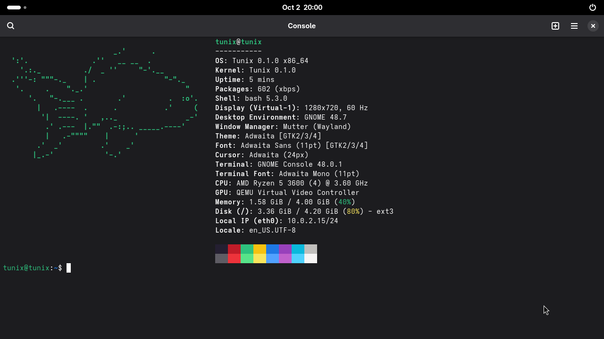

# GNOME

`make DESKTOP=gnome` builds an image that boots into GDM and logs into GNOME 48: gnome-shell and mutter as the
Wayland compositor on the kernel's atomic KMS device, Xwayland for X clients,
and Void's own GNOME packages around them. Nothing in it is patched.



```sh
make DESKTOP=gnome            # build the GNOME image
make DESKTOP=gnome run-virgl  # boot it on the host GPU through virgl
```

Log in as `tunix` / `tunix`. Rendering is llvmpipe unless the machine has a
virtio-gpu with virgl; through virgl the shell holds 60 fps and GTK apps open
in about a second (see [virtio-gpu](virtio-gpu.md#under-gnome)).

## What runs

Four runit services, listed in `base-files/services-gnome`, and the files in
`base-files/overlay-gnome` laid over the sysroot:

| Service | Why |
| --- | --- |
| `dbus` | the system bus everything below talks over |
| `elogind` | seats, sessions, VT switching and device handover |
| `polkitd` | authorization for elogind and the session's settings |
| `gdm` | the login screen, and the session it starts |

GDM's greeter is itself a gnome-shell. When `tunix` logs in, the greeter's
worker opens a PAM session, elogind creates a session for it on a free VT,
switches there, and the new gnome-shell asks elogind for the DRM card and the
input devices with `TakeDevice`. Nothing in the session opens a device itself.

## What the kernel needed

Each of these was a session that would not start, or started and showed
nothing, until the kernel did what Linux does:

- **cgroups.** elogind refuses to run without them. `cgroupfs` provides the
  unified cgroup2 hierarchy and named v1 hierarchies such as `name=elogind`,
  with `cgroup.procs`, `cgroup.events` (and its inotify notification),
  `cgroup.kill`, `/proc/<pid>/cgroup`, and mount options passed through
  `mount(2)`. A session is a cgroup, and `sd_pid_get_session` reads it back
  from `/proc/<pid>/cgroup`.
- **`statfs` magic numbers.** sd-device rejects a `/sys` that does not report
  `SYSFS_MAGIC`, and elogind then finds no devices on the seat.
- **`/sys/class/tty/tty0/active`**, with a poll wake-up when it changes, so
  elogind follows VT switches; and an input parent device under
  `/sys/devices/virtual/input`, without which elogind cannot place the event
  devices on a seat.
- **Mounts.** tmpfs honours `mode=`, `uid=` and `gid=` (`/run/user/<uid>`),
  mounts stack on one another and come off with `MNT_DETACH`, and
  `/proc/<pid>/mountinfo` describes them.
- **Signals.** `rt_sigsuspend`, `rt_sigtimedwait`, `rt_sigpending` and `pause`;
  a temporary mask that survives until the handler runs; `si_code` of
  `SI_TKILL` for `tgkill`, which glibc's `setuid` broadcast checks; and `poll`
  and `nanosleep` that never restart themselves after a handler.
- **Threads and their children.** A child forked by any thread belongs to the
  whole thread group, so another thread can wait for it.
- **PI futexes**, `FUTEX_WAKE_OP` and `FUTEX_CMP_REQUEUE`.
- **Unix datagram sockets**, for `/dev/log` and for elogind's notifications.
- **DRM.** The connector reports its `CRTC_ID` property in `GETCONNECTOR`,
  object properties carry their real types, `CLOSEFB` closes a framebuffer,
  `SET_MASTER` from elogind gives the display to the VT that just became
  active, and page-flip events belong to the file that asked for them: with a
  shared queue, any other open of the card could read mutter's event, and
  mutter then waited for it forever.
- **`/proc/<pid>/environ`.**

## What is not here

- seccomp and Landlock: OpenSSH's sandbox and localsearch's extractor refuse to
  run without them, and Firefox runs with its sandboxes off.
- `pidfd_open` and `timer_create`: the portal and `chvt` fall back or fail.
- POSIX ACLs on device nodes; elogind logs that it cannot apply them.
- PipeWire is installed but not started, so there is no sound in the session.
