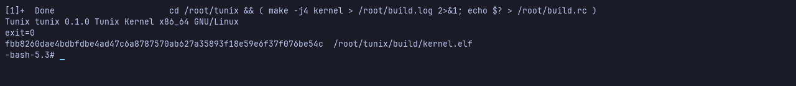
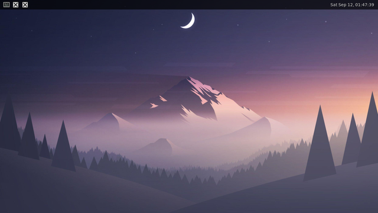

# Self-Hosting

Tunix compiles Tunix. Clone the repository inside the running system, run
`make kernel`, and the `build/kernel.elf` that comes out boots the desktop.
It is not byte for byte the host's build of the same commit, because the image
carries Void's gcc 14 and the host that built the image may carry any other --
nothing in the tree stamps a date or a revision into the binary.

```sh
git clone --depth 1 https://github.com/tuna4ll/tunix.git
cd tunix
make -j4 kernel
```

## What the image carries

`VOID_INSTALL_TOOLCHAIN` in the GNUmakefile adds the packages the kernel build
asks for, and nothing else:

| Package | Why |
| --- | --- |
| `gcc`, `binutils` | the compiler and the linker |
| `make` | the build itself |
| `python3`, `python3-Pillow` | `support/terminal-font.py` rasterises the console font |
| `git` | the clone, and the Limine checkout the build makes for itself |
| `mtools` | the FAT filesystem the bootloader is read from |

The kernel takes its boot protocol header from Limine, and the header and the
bootloader that reads it have to be the same version, so `make kernel` clones
`build/limine` before it compiles anything. That and the clone of Tunix are the
two things the build needs a network for.

`make all` goes further and builds the disk image too: the Void sysroot with
xbps, an ext3 root, a FAT ESP, a GPT table, and Limine written into it. Nothing
in that needs a loop device -- every filesystem is built inside a plain file --
so the whole thing runs on Tunix as it stands:

```sh
make all VOID_INSTALL_BROWSER= VOID_INSTALL_GAMES= VOID_INSTALL_TOOLCHAIN= \
	IMAGE_SLACK_MIB=64
```

The trimming is not a limitation of the build but of the room it has to work
in. A file's contents live in the kernel's heap while anything holds it open,
so the image being written is in memory as well as on disk, and so is the root
filesystem it is copied from. With the browser, the game and the compiler left
out, the artifact is about 790 MiB and the whole build fits in a 6 GiB machine
with a couple of gigabytes of disk to spare. Ask for the full package set and
it will run out of one or the other.

## What had to work first

Ten things stood between a toolchain in the image and an image out of it. Every
one of them was a place where Tunix answered a system call in a way Linux does
not, and every one had been sitting there unnoticed because nothing else in the
userland asked. The first four are what `make kernel` needed; the rest are what
`make all` needed on top.

### getcwd returns a length

`getcwd(NULL, 0)` is glibc's allocating form: it asks the kernel to fill a
buffer and takes the answer as the size to shrink its allocation to. Tunix
returned the buffer pointer instead, which glibc reads as a failure with no
errno set. Every build opened with `make: getcwd: Success` and then built from
whatever directory make had guessed.

### A parallel make waits in pselect

GNU make 4.4 hands out job slots through a jobserver. A job that wants a slot
blocks `SIGCHLD`, then waits in `pselect6` with a signal mask that unblocks it
again for exactly as long as the wait lasts, so a child exiting interrupts the
wait and nothing is missed in between.

Tunix ignored the mask argument entirely, so `SIGCHLD` stayed blocked, and a
child's exit only ever woke a parent that was sitting in `wait4`. `make -j4`
slept forever with three compilers behind it as zombies:

```
529 S  08:35 make
553 Z  08:30 gcc <defunct>
554 Z  08:30 gcc <defunct>
555 Z  08:30 gcc <defunct>
```

`pselect6` and `ppoll` now swap in the mask they are given for the length of
the wait and put the old one back before they return, and a child's exit wakes
a parent blocked anywhere -- not only in `wait4` -- whenever `SIGCHLD` would
actually reach a handler. `Ctrl+Alt+D` printed the state that showed which of
the two it was: `make` was in `io-syscall=270`, not in `wait4`.

### The link line is ninety arguments

`execve` staged its arguments in a fixed 64 by 4096 array, which is one
argument for every eight the final link passes:

```
cc -nostdlib ... build/kernel/abi_gaps.c.o ... build/kernel/vmm.c.o -o build/kernel.elf
```

Eighty-four objects and the flags around them. The failure was quiet -- make
reported `Error 127` and printed nothing else -- because make execs a recipe
with no shell characters in it directly and does not say why the exec failed.
Run by hand under `/bin/sh` it says what it is:

```
/root/link.sh: 1: cc: Argument list too long
```

Arguments and environment now share one 256 KiB pool, up to 512 entries each.
The old array cost half a megabyte per `execve` to hold 64; the pool costs half
that to hold eight times as many, because it stores the strings end to end
rather than giving each one a 4 KiB slot it will not use.

### connect answers once

A blocking `connect` on a stream socket sleeps and re-runs itself until the
handshake finishes. The handshake also marks the socket connected, and the
retry took that as proof it had already answered somebody -- so on a connection
that came up fast enough, the call that should have returned success returned
`EISCONN`. Loopback and the QEMU user network are both that fast:

```
-bash: connect: Transport endpoint is already connected
```

Whether the socket is connected and whether `connect` has said so are now two
different facts.

### A package manager needs a root of its own

xbps installs into a directory rather than onto the running system, and the
scripts a package carries have to run as if that directory were `/`. It does
that the way everything does: `fork`, `chroot`, `chdir("/")`, `exec`. Tunix had
no `chroot` at all, so every package that runs a script failed with `Function
not implemented` and the transaction was abandoned.

A process now carries its own root alongside its working directory. An absolute
path is resolved from it, `..` stops there rather than climbing out, `getcwd`
reports the path as the process sees it, and a symbolic link whose target is
absolute lands inside rather than outside. Two places had to be told separately:
`execve` builds the new image in a scratch structure that did not carry the
root, so the interpreter of a dynamically linked program was still being found
outside -- which is how a 2025 `ld.so` came to load a 2024 `libc.so.6` and say

```
/bin/sh: symbol lookup error: /usr/lib64/libc.so.6: undefined symbol: __nptl_change_stack_perm
```

### A script is told the name it was called by

Void's install scripts say why they are careful about this:

> Note that paths must be relative to CWD, to avoid calling host commands if
> /bin/sh (dash) is not installed and it's not possible to chroot(2).

So the script runs `./usr/libexec/xbps-triggers/system-accounts`, the kernel
sees a `#!` line, and hands the path to the interpreter. Tunix handed over the
path it had resolved -- absolute, and correct only from outside the chroot --
where Linux hands over the string the caller passed. The interpreter could not
open a file that, from where it stood, did not exist, so no package ever
created its system users. The image built that way had no `_seatd` group, and
without the group there is no seat daemon and no desktop.

### Unknown open flags are ignored, not refused

`dd` asks for `oflag=seek_bytes`, which is not a kernel flag at all: it is a
private bit in coreutils that happens to travel to `open` along with the real
ones. Linux ignores bits it does not know. Tunix rejected the call, so writing
the two filesystems into the disk image failed with `Invalid argument` on a file
it had just created.

### Extended attributes answer for a filesystem that has none

`mke2fs -d` copies each file's extended attributes into the image it is
building, and asks for them with `llistxattr`. `Function not implemented` is
fatal to it. The Tunix filesystem has no extended attributes, so the honest
answer is an empty list, `ENODATA` for a read and `EOPNOTSUPP` for a write --
all of which it takes in its stride.

### The filesystem revision is now written down

`support/image.sh` already pins the block size, the inode size and the exact
feature set, because the kernel's ext2 driver reads one format and no other.
It did not pin the revision, and the mke2fs in the image defaults it
differently from the one on a modern host:

```
Filesystem features not supported with revision 0 filesystems
```

`-r 1` says what the other flags already implied.

## Doing it twice

A kernel built inside Tunix boots into the desktop, Firefox and all. Put that
kernel in the image, boot it, and build again, and the second kernel is byte
for byte the first:



That is the whole claim. The first generation only shows the toolchain runs;
the second shows it runs the same way the host's did, because a kernel that
compiled itself wrong would not hash the same as the one that compiled it.

Building inside a kernel from before these fixes does not get that far. It
stops where `make -j4` stopped in the first place, with three compilers exited
and nobody left awake to reap them.

## The image it builds

`make all` inside Tunix ends the way it does anywhere else:

```
Limine BIOS stages installed successfully!
:: build/tunix.img ready, gpt (789M)
```

Copy that file out and boot it, and it comes up on its own -- Limine, the
kernel it just compiled, runit, udev, the seat daemon, and the session:



The wallpaper is the point. Nothing in that picture was made by the machine
this file is being read on.
