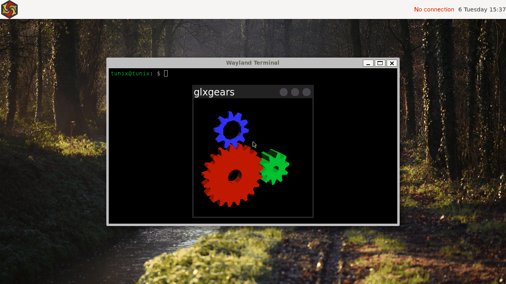

# Wayfire

[Wayfire](https://wayfire.org) is not in the image. It is installed on a
running Tunix with Void's own package manager and started from a console, like
on any Void machine:



```sh
sudo xbps-install -S wayfire wf-shell
wayfire
```

Log in on a text console first (Ctrl+Alt+F2, `tunix` / `tunix`). On the GNOME
image the session comes from elogind; on the Weston image it comes from seatd,
which also lets Weston keep running on its own terminal. Ctrl+Alt+F1 (Weston)
or Ctrl+Alt+F7 (GDM) switches away and Ctrl+Alt+F2 comes back; Super+Esc ends
the session.

Both packages are Void's own, wlroots 0.20 underneath, and nothing in them is
patched. `wf-shell` is the panel and the wallpaper; without it the session is a
plain background.

## What the image adds

Two files in `base-files/overlay/etc`, so a freshly installed Wayfire starts
usable:

| File | Why |
| --- | --- |
| `profile.d/wayland.sh` | sets `XDG_RUNTIME_DIR` on the Weston image, which has no elogind to do it, and `WLR_RENDERER_ALLOW_SOFTWARE=1` when there is no virgl |
| `xdg/wayfire/wayfire.ini` | the configuration used while `~/.config/wayfire.ini` does not exist, found through `profile.d/wayfire.sh` |

Without `WLR_RENDERER_ALLOW_SOFTWARE`, wlroots refuses llvmpipe and drops to
its pixman renderer, and the cube, expo, switcher and blur plugins switch
themselves off. Through virgl (`make run-virgl`) the renderer is the host's
GPU and the variable is not set.

Void ships Wayfire's sample configuration in
`/usr/share/examples/wayfire/wayfire.ini`; it binds Super+Enter to `alacritty`
and leaves out the plugin list Void does not build (`fisheye`). Tunix's file
names the plugins Void does build, binds Super+Enter to whichever terminal the
image has (`kgx` or `weston-terminal`), and Super+Esc to leaving. Copy it to
`~/.config/wayfire.ini` to change anything; Wayfire reloads it on save.

`/etc/wayfire/defaults.ini` would look like the place for this, but it can only
change the defaults of options that already exist, and key bindings are
entries of a list that does not.

## What the kernel needed

wlroots asks the kernel a little more than Weston and mutter did:

- **`/sys/dev/char/226:0/device/drm`.** libdrm's `drmGetDeviceNameFromFd2()`
  checks that directory before it trusts a character device as a DRM node.
  It was only published when virgl was present; without virgl the card now has
  a `device` parent on the platform bus, as a simple framebuffer does on Linux.
- **`DRM_MODE_OBJECT_ANY`.** wlroots reads the type of each plane with object
  type 0, which Linux resolves from the object id. Tunix answered `EINVAL`, and
  the DRM backend gave up without saying why.
- **Leases.** wlroots reopens the card for its allocator with an empty
  `DRM_IOCTL_MODE_CREATE_LEASE`, and falls back to opening the node again when
  the driver says `EOPNOTSUPP`. The ioctl was unknown (`ENOTTY`), which wlroots
  treats as fatal.
- **`lseek` on a dma-buf.** Mesa's software winsys learns the size of an
  imported buffer with `lseek(fd, 0, SEEK_END)`. It answered `ESPIPE`, so every
  `eglCreateImageKHR` from a dma-buf failed and the GLES renderer could not
  start.
- **The Unix socket backlog.** wlroots listens on the X11 socket with a
  backlog of one, and Wayfire connects to it the moment Xwayland is ready.
  Linux queues one connection past the backlog and makes a blocking `connect`
  wait for room; Tunix refused with `ECONNREFUSED`, and Wayfire never learned
  the X atoms it needs to tell dialogs from windows.
- **A display shared between sessions.** With GDM's greeter still on its
  terminal, the greeter's VT kept owning the framebuffer after a switch, so
  the next session's page flips failed with `EBUSY`. A VT in the background now
  gives the display up to the one in front.
- **`fchownat(fd, "", ..., AT_EMPTY_PATH)`**, which elogind uses to hand a VT
  back when a session ends.
- **The console's margins** are cleared when it is drawn again, so leaving a
  session no longer leaves its last frame around the text.

Each one is covered: `drmtest` (`WLROOTS`), `unixlisten-kerneltest.sh` and
`vtgraphics-kerneltest.sh`.

## What is not here

- **One processor.** With `-smp 1`, X11 windows map in Wayfire but are never
  drawn; Wayland clients are fine, and Weston shows the same X11 window on the
  same machine. Two processors or more do not show it.
